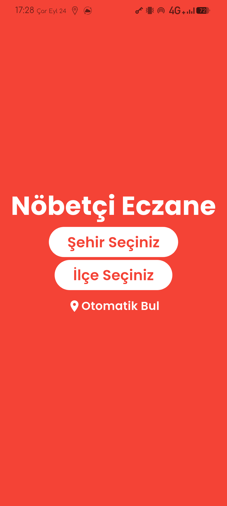
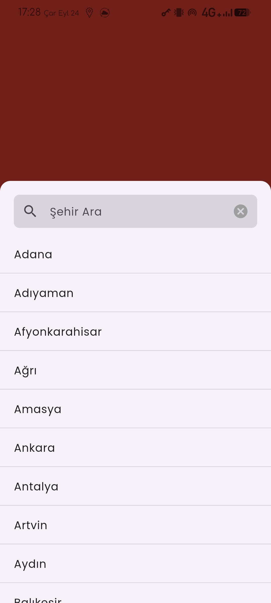
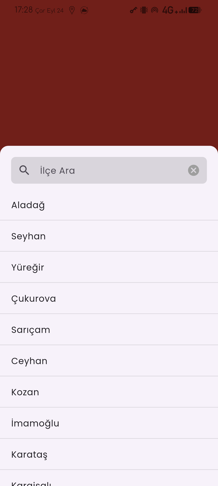
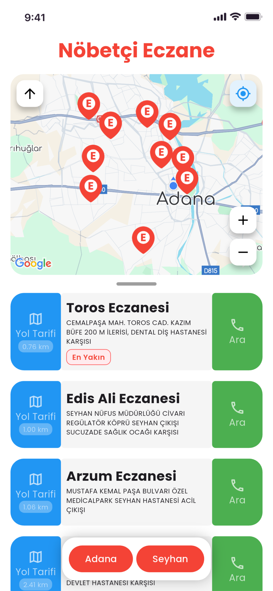
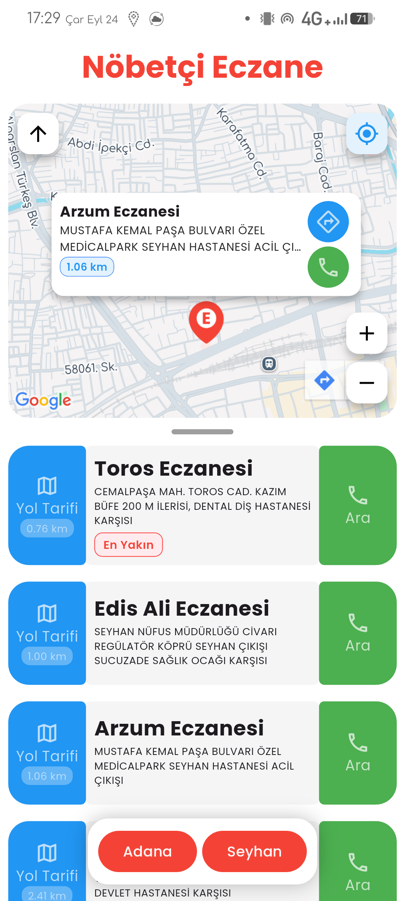
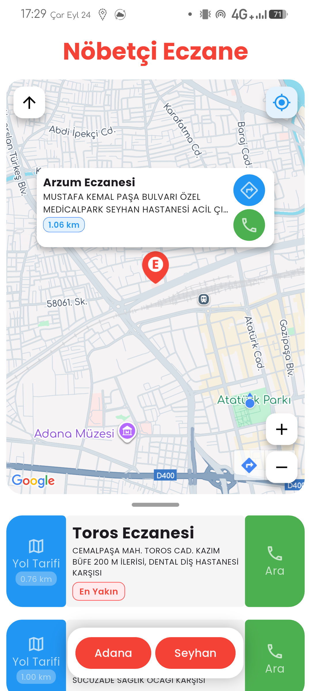

# Nöbetçi Eczane 🏥💊

Türkiye genelinde nöbetçi eczaneleri kolayca bulmanızı sağlayan modern ve kullanıcı dostu mobil uygulama.

## 🚀 Özellikler

- **Konum Tabanlı Arama**: GPS ile mevcut konumunuza en yakın nöbetçi eczaneleri bulun
- **Şehir ve İlçe Seçimi**: 81 il ve tüm ilçeler arasından seçim yapabilirsiniz
- **Harita Entegrasyonu**: Google Maps ile eczane konumlarını görüntüleyin
- **Mesafe Bilgisi**: Her eczaneye olan mesafeyi öğrenin
- **İletişim**: Eczaneleri doğrudan arayabilirsiniz
- **Yol Tarifi**: Harita uygulaması ile navigasyon desteği
- **Gerçek Zamanlı Veri**: Güncel nöbetçi eczane bilgileri

📱 Ekran Görüntüleri

Ana Ekran ve Lokasyon Seçimi

Şehir ve İlçe Seçimi

Harita Görünümü ve Eczane Listesi

Eczane Detayları ve İletişim

## 🛠️ Teknolojiler

- **Frontend**: Flutter (Dart)
- **Backend API**: n8n (No-code automation)
- **Harita**: Google Maps API
- **Platform**: Android & iOS

## 📥 İndirme

Uygulamanın son sürümünü indirmek için:

1. [Releases](../../releases) bölümüne gidin
2. En son sürümü indirin
3. APK dosyasını Android cihazınıza yükleyin

> **Not**: iOS kullanıcıları için App Store sürümü yakında yayınlanacaktır.

## 📞 İletişim

- **Geliştirici**: [Adınız]
- **E-posta**: [email@example.com]
- **LinkedIn**: [linkedin.com/in/profiliniz]

## 🙏 Teşekkürler

- Eczane verilerini sağlayan resmi kaynaklara
- Flutter ve Dart topluluğuna
- n8n automation platformuna
- Google Maps API'sine

## 📊 Durum

---

⭐ Bu projeyi beğendiyseniz yıldız vermeyi unutmayın!

## 🔄 Sürüm Geçmişi

### v1.0.0 (2024)
- ✅ İlk stabil sürüm
- ✅ Temel eczane arama özelliği
- ✅ Harita entegrasyonu
- ✅ Konum tabanlı arama
- ✅ Şehir/ilçe filtreleme

### Gelecek Sürümler
- 🔄 Push notification desteği
- 🔄 Favori eczaneler
- 🔄 Çevrimdışı mod
- 🔄 Kullanıcı yorumları ve değerlendirmeleri
